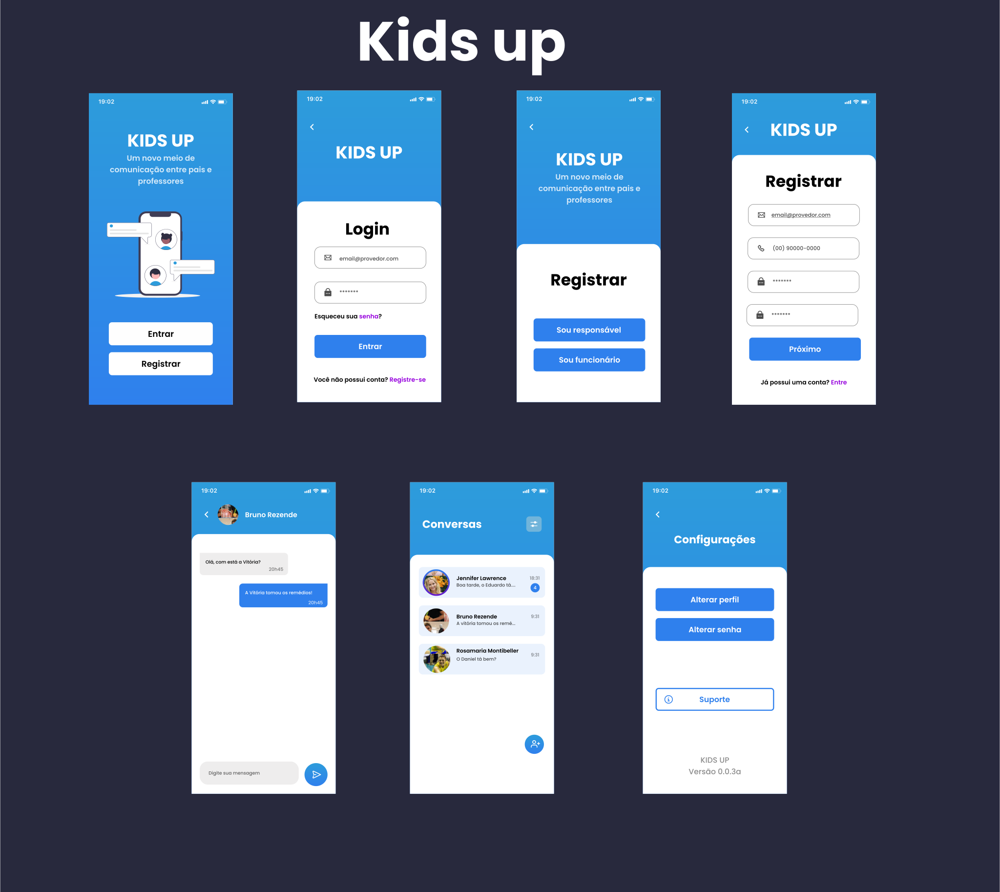

 

 
 # Kids Up Mobile
 ### Kids Up is an app that facilitates the communication of parents and caregivers in a day care center
  - This version is just the visual part of the project

  ## 💻 Preview


 ## 👨‍💻 This project was developed with the following technologies:

 ### React Native
 React Native combines the best parts of native development with React, a best-in-class JavaScript library for building user interfaces.

 Website: https://reactnative.dev/

 ### Expo 
Expo is an open-source platform for making universal native apps for Android, iOS, and the web with JavaScript and React.

Website: https://expo.dev/

### Typescript 

TypeScript is an open-source language which builds on JavaScript, one of the world’s most used tools, by adding static type definitions. (Official Website)

Website: https://www.typescriptlang.org/

### Tools

You go need these tools to install this repository on your local machine:

- Git -> https://git-scm.com/downloads
- Node -> https://nodejs.org/en/

### Running Locally

#### Cloning the Repository:

First of all, clone the repository by running the following command:

```bash
git clone https://github.com/Mateus-Kent/kids-up-mobile.git
```

#### Installing the project's dependencies

You can install the project's dependencies by running the following command inside the project's folder:

```bash
npm install
```

## :joystick: Scripts

### run the project with the expo

```bash
expo start
```


